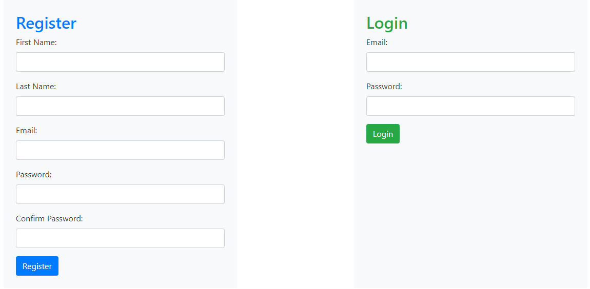

# Python-Flask-Authentication

In this repository, I'm going to build a Flask application that allows login and registration.

- Build an application that requires login and registration
- Practice connecting a Flask application to a MySQL database
- Become familiar with the logic that is required to validate a user's registration to a website
- Become familiar with the logic that is required to validate a user logging in to a website
- Process a user logging out of an application
- Practice using session

## ERD (Entity Relationship Diagram)

## Installing

Install and update using `pip`\_:

    $ pip install -U Flask
    $ pipenv install Flask PyMySQL

.. \_pip: https://pip.pypa.io/en/stable/getting-started/

    $ flask run
      * Running on http://127.0.0.1:5000/ (Press CTRL+C to quit)

##

